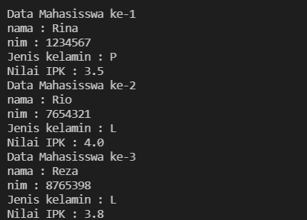

# Laporan Praktikum Pertemuan 2
## Nama  : Ahmad Bima Tristan Ibrahim
## Nim   : 2141720077
## Kelas : TI-1F
## Absen : 02

### **SubBab 3.2 Membuat Array dari Object, Mengisi dan Menampilkan**
**Pertanyaan :**
1. Berdasarkan uji coba 3.2, apakah class yang akan dibuat array of object harus selalu memiliki
atribut dan sekaligus method?Jelaskan!

Jawaban: **Tidak, karena dalam class array of object tidak mengharuskan memiliki atribut sekaligus method tergantung kondisi yang kita perlukan.** 

2. Apakah class PersegiPanjang memiliki konstruktor?Jika tidak, kenapa dilakukan pemanggilan
konstruktur pada baris program berikut : 


Jawaban: **Sebetulnya pada array of object persegi panjang kita telah memanggil default konstruktor, karena default konstruktor tidak memiliki parameter maka kita tidak wajib memberikan nilai pada parameternya.**

3. Apa yang dimaksud dengan kode berikut ini:


Jawaban : **kode tersebut adalah instansiasi dari array of object**

4. Apa yang dimaksud dengan kode berikut ini:


Jawaban : **kode tersebut adalah inisialisasi/pengisian sebuah nilai terhadap pparray[1] atau indeks yang pertama.**

5. Mengapa class main dan juga class PersegiPanjang dipisahkan pada uji coba 3.2?

Jawaban: **karena agar memudahkan kita dalam membuat programnya dan tidak membingungkan kita saat merubah atribut atau method dalam object persegi panjang**

### **SubBab 3.3 Menerima Input Isian Array Menggunakan Looping**
**Pertanyaan :**
1. Apakah array of object dapat diimplementasikan pada array 2 Dimensi?

jawaban : **Ya bisa,array of object dapat di implementasikan array 2 dimensi.**

2. Jika jawaban soal no satu iya, berikan contohnya! Jika tidak, jelaskan!

Jawaban : **Array of object dapat diimplementasikan pada array dua dimensi, dimana sama seperti mengimplementasikan array dua dimensi pada umumnya.**

**Contohnya pada program java yang bisa menyimpan data mahasiswa yang berisikan nama dan kelas**
```java
import java.util.Scanner;

public class percobaanTiga{
    public static void main(String[] args){
        Scanner input = new Scanner(System.in);
        System.out.print("Jumlah Mahasiswa: ");
        int n = input.nextInt();
        coba[][] mhs = new coba[n][1];

        for (int j= 0; int < mhs[i].length; j++){
            mhs[i][j] = new coba();
            System.out.print("Masukkan Nama: ");
            mhs[i][j].nama = input.next().charAt(0);
            System.out.print("Masukkan Kelas: ");
            mhs[i][j].data = input.next().charAt(0);
            System.out.print();
        }
    }
}
```

3. Jika diketahui terdapat class Persegi yang memiliki atribut sisi bertipe integer, maka kode
dibawah ini akan memunculkan error saat dijalankan. Mengapa?


Jawaban : **Tentu saja akan terjadi error, karena array of objectnya belum ter instansiasi.** 

**contoh : Persegi [0] pgArray = new Persegi();**

4. Modifikasi kode program pada praktikum 3.3 agar length array menjadi inputan dengan Scanner!

Jawaban : 
```java
package Sourcecode;

import java.util.Scanner;

public class arrayObjectModif {
    public static void main(String[] args) {
        Scanner sc = new Scanner(System.in);
        System.out.print("Masukkan panjang Elemen: ");
        int n = sc.nextInt();

        PersegiPanjang[] ppArray = new PersegiPanjang[n];

        for (int i = 0; i < ppArray.length; i++) {
            ppArray[i] = new PersegiPanjang();
            System.out.println("Persegi Panjang ke-" + i);
            System.out.print("Masukkan nilai panjang: ");
            ppArray[i].panjang = sc.nextInt();
            System.out.print("Masukkan nilai lebar: ");
            ppArray[i].lebar = sc.nextInt();
        }

        for (int i = 0; i < ppArray.length; i++) {
            System.out.println("Persegi Panjang ke-" + i);
            System.out.println("Panjang: " + ppArray[i].panjang + ", Lebar: " + ppArray[i].lebar);
        }
    }
}
```

5. Apakah boleh Jika terjadi duplikasi instansiasi array of objek, misalkan saja instansiasi dilakukan
pada ppArray[i] sekaligus ppArray[0]?Jelaskan !

Jawaban : **Tidak boleh, karena akan terjadi error terhadap system. System akan bingung membaca program kita terdapat 2x instansiasi pparray[0].**

### **SubBab 3.4 Operasi Matematika Atribut Object Array**
**Pertanyaan :**
1. Dapatkah konstruktor berjumlah lebih dalam satu kelas? Jelaskan dengan contoh! 

Jawaban : **Bisa, kita dapat menggunakan constructor overloading sebagai pembedanya adalah tipe parameter dan atau jumlah parameternya**

Contoh : 
``` java
public class Siswa{
    int nomorIndukSiswa,noTelfon;
    String nama,sekolah;
Siswa(String s,int ntlp){
    this.s=Sekolah;
    this.ntlp=noTelpon;
}
Siswa(int nis,String n){
    this.nis=nomorIndukSiswa;
    this.n=nama
}
}
```
2. Jika diketahui terdapat class Segitiga seperti berikut ini:

Tambahkan konstruktor pada class Segitiga tersebut yang berisi parameter int a, int t
yang masing-masing digunakan untuk mengisikan atribut alas dan tinggi.

Jawaban : 
``` java
public class segitiga {
    public int alas, tinggi;

    public segitiga(int a, int t) {
        alas = a;
        tinggi = t;
    }
}
```
3. Tambahkan method hitungLuas() dan hitungKeliling() pada class Segitiga
tersebut

Jawaban : 
``` java
public int hitungLuas() {
        return alas * tinggi / 2;
    }

    public int hitungKeliling() {
        return alas + alas + alas;
    }
}
```
4. Pada fungsi main, buat array Segitiga sgArray yang berisi 4 elemen, isikan masing-masing
atributnya sebagai berikut:

Jawaban : 
``` java
Segitiga[] sgArray = new Segitiga [4];
sgArray[0]= new Segitiga(10, 4);
sgArray[1]= new Segitiga(20, 10);
sgArray[2]= new Segitiga(15, 6);
sgArray[3]= new Segitiga(25, 10);
```

5.Kemudian menggunakan looping, cetak luas dan keliling dengan cara memanggil method
hitungLuas() dan hitungKeliling().

Jawaban :
``` java
for (int i = 0; i < 4; i++) {
            System.out.println("Luas Segitiga ke-" + i + ": " + sgArray[i].hitungLuas());
        }

        for (int i = 0; i < 4; i++) {
            System.out.println("Keliling Segitiga ke-" + i + ": " + sgArray[i].hitungKeliling());
        }
```
Output : 


## **SubBab 3.5 Latihan Praktikum**

## Soal NO 1 

**Source Code**

**Balok**
```java
package Latihan;

public class balok {
    public int panjang, lebar, tinggi;

    public balok(int p, int l, int t) {
        panjang = p;
        lebar = l;
        tinggi = t;
    }

    public int volume() {
        return panjang * lebar * tinggi;
    }

    public int luasPermukaan() {
        return 2 * (panjang * lebar + panjang * tinggi + lebar * tinggi);

    }
}
```
## **Kubus**
```java
package Latihan;

public class kubus {
    public int sisi;

    public kubus(int s) {
        sisi = s;
    }

    public int volume() {
        return sisi * sisi * sisi;
    }

    public int luasPermukaan() {
        return 6 * (sisi * sisi * sisi);
    }
}
```
## **Bola**
```java
package Latihan;

public class bola {
    public int jari;

    public bola(int r) {
        jari = r;
    }

    public double volume() {
        return (4 / 3) * 3.14 * (jari * jari * jari);
    }

    public double luasPermukaan() {
        return 4 * 3.14 * (jari * jari * jari);
    }
}
```

## **Bangun Ruang**
```java
package Latihan;

import java.util.Scanner;

public class bangunRuang {

    public static void main(String[] args) {
        Scanner sc = new Scanner(System.in);

        System.out.print("Masukan banyak kubus : ");
        int k = sc.nextInt();
        int s;
        kubus[] kbArray = new kubus[k];
        System.out.println("-----------------------");
        for (int i = 0; i < kbArray.length; i++) {
            System.out.print("Masukan sisi ke-" + (i + 1) + ": ");
            s = sc.nextInt();
            kbArray[i] = new kubus(s);
        }
        for (int i = 0; i < kbArray.length; i++) {
            System.out.println();
            System.out.println("Kubus ke - " + (i + 1));
            System.out.println("Sisi : " + kbArray[i].sisi);
            System.out.println("Volume ke-" + (i + 1) + ": " + kbArray[i].volume());
            System.out.println("Luas permukaan ke-" + (i + 1) + ": " + kbArray[i].luasPermukaan());
        }
        System.out.println();
        System.out.println("Masukan banyak balok : ");
        int b = sc.nextInt();
        int p, l, t;
        balok[] bArray = new balok[b];
        System.out.println("------------------------");
        for (int i = 0; i < bArray.length; i++) {
            System.out.print("Masukan panjang " + (i + 1) + ": ");
            p = sc.nextInt();
            System.out.print("Masukan lebar " + (i + 1) + ": ");
            l = sc.nextInt();
            System.out.print("Masukan tinggi " + (i + 1) + ": ");
            t = sc.nextInt();
            bArray[i] = new balok(p, l, t);
        }
        for (int i = 0; i < bArray.length; i++) {
            System.out.println();
            System.out.println("Balok ke - " + (i + 1));
            System.out.println("Panjang : " + bArray[i].panjang);
            System.out.println("Lebar : " + bArray[i].lebar);
            System.out.println("Tinggi : " + bArray[i].tinggi);
            System.out.println("Volume ke- " + (i + 1) + ": " + bArray[i].volume());
            System.out.println("Luas perukaan ke- " + (i + 1) + ": " + bArray[i].luasPermukaan());
        }
        System.out.println();
        System.out.print("Masukan banyak bola : ");
        int bo = sc.nextInt();
        int r;
        bola[] boArray = new bola[bo];
        System.out.println("---------------------");
        for (int i = 0; i < boArray.length; i++) {
            System.out.print("Masukan jari-jari " + (i + 1) + ": ");
            r = sc.nextInt();
            boArray[i] = new bola(r);
        }
        for (int i = 0; i < boArray.length; i++) {
            System.out.println();
            System.out.println("Bola ke - " + (i + 1));
            System.out.println("Jari-jari : " + boArray[i].jari);
            System.out.println("Volume ke - " + (i + 1) + ": " + boArray[i].volume());
            System.out.println("Luas permukaan ke - " + (i + 1) + ": " + boArray[i].luasPermukaan());
        }
        System.out.println();
    }
}
```

**Output** 


## Soal NO 2

**Tanah**
```java
package Latihan;

public class jbTanah2 {
    public int panjang, lebar;

    public int luasTanah() {
        return panjang * lebar;
    }

    public int tanahTerluas(int luas[]) {
        int terluas = 0;
        int y = 0;
        for (int i = 0; i < luas.length; i++)
            if (luas[i] > terluas) {
                terluas = luas[i];
                y = i;
            }
        return y;
    }
}
```

**TanahMain**
```java
package Latihan;

import java.util.Scanner;

public class mainTanah2 {

    private static int i;

    public static void main(String[] args) {
        Scanner sc = new Scanner(System.in);
        System.out.print("Masukkan jumlah tanah : ");
        int n = sc.nextInt();
        jbTanah[] tnArray = new jbTanah[n];
        System.out.println();
        for (int i = 0; i < n; i++) {
            tnArray[i] = new jbTanah();
            System.out.println("Tanah " + (i + 1));
            System.out.print("Panjang : ");
            tnArray[i].panjang = sc.nextInt();
            System.out.print("Lebar : ");
            tnArray[i].lebar = sc.nextInt();
        }
        System.out.println();
        for (int i = 0; i < n; i++) {
            System.out.println("Luas Tanah " + (i + 1) + ": " + tnArray[i].luasTanah());
        }
        System.out.println();
        int y = 0;
        int luas[] = new int[n];
        for (int i = 0; i < n; i++) {
            luas[i] = tnArray[i].luasTanah();
        }
        y = tnArray[0].tanahTerluas(luas);
        System.out.println("Tanah terluas : Tanah " + (y + 1));
    }
}
```

**Output**


## Soal No 3


**class Mahasiswa**
```java
package Latihan;

import java.util.Scanner;

public class Mahasiswa {
    Scanner sc = new Scanner(System.in);
    String nama;
    int NIM;
    char kelamin;
    double ipk;

    void tampil() {
        System.out.println("nama : " + nama);
        System.out.println("nim : " + NIM);
        System.out.println("Jenis kelamin : " + kelamin);
        System.out.println("Nilai IPK : " + ipk);
    }

    void input() {
        System.out.print("Masukkan nama : ");
        nama = sc.nextLine();
        System.out.print("Masukkan nim : ");
        NIM = sc.nextInt();
        System.out.print("Masukkan jenis kelamin : ");
        kelamin = sc.next().charAt(0);
        System.out.print("Masukkan Nilai IPK : ");
        ipk = sc.nextDouble();
    }
}
```

**class MahasiswaMain**
```java
package Latihan;

public class mahasiswaMain {
    public static void main(String[] args) {
        Mahasiswa[] mhs = new Mahasiswa[3];

        for (int i = 0; i < mhs.length; i++) {
            mhs[i] = new Mahasiswa();
            System.out.println("Masukkan data mahasiswa ke-" + (i + 1));
            mhs[i].input();
            System.out.println();
        }
        System.out.println();

        for (int i = 0; i < mhs.length; i++) {
            System.out.println("Data Mahasisswa ke-" + (i + 1));
            mhs[i].tampil();
        }
    }
}
```

**Output**




